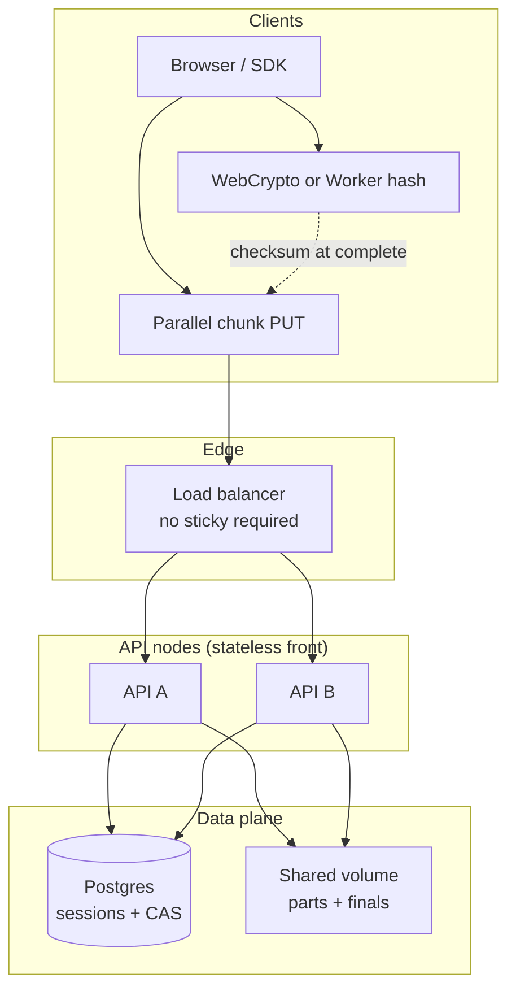
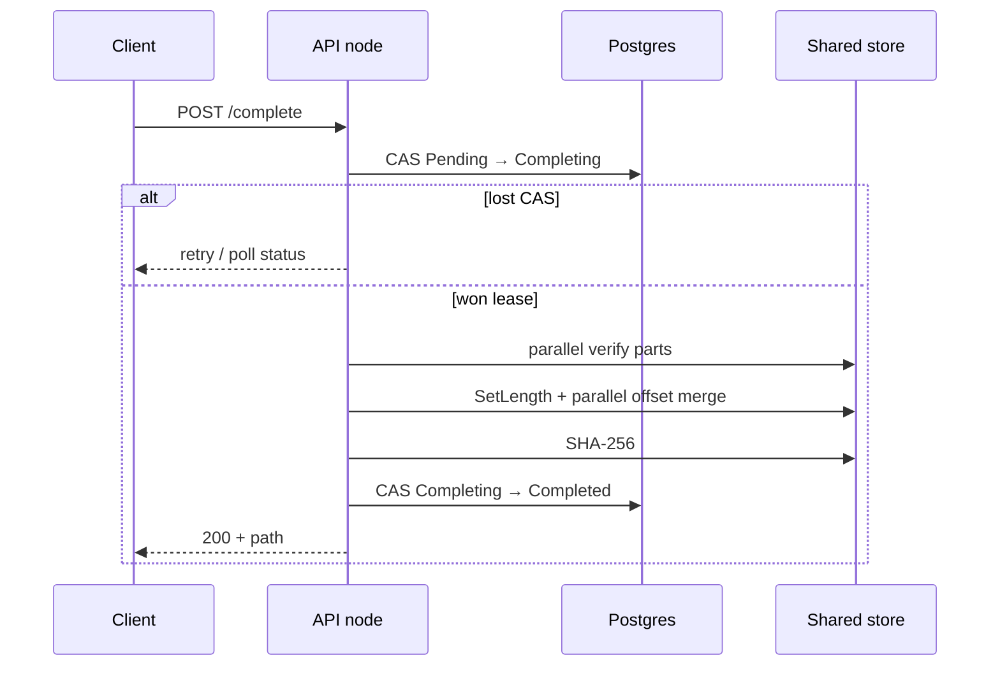
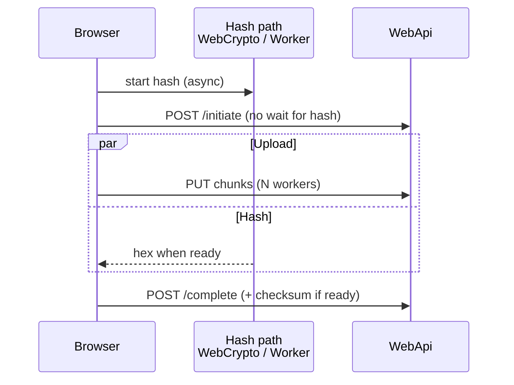

# File Uploader

**S3-inspired, own data-plane file service** for very large uploads — resumable, parallel, multi-instance ready.

[](https://dotnet.microsoft.com/)
[](#architecture)
[](#multi-instance-p4)
[](#client-performance)
[](#proofs--quality)
[](https://github.com/0x-mhmdnzri/File-Uploader/tree/dev)

> Upload **5 GB – 20 GB+** with chunked parallel transfers, **hardware WebCrypto hashing that does not block upload**, disk-as-truth verification, pre-allocated merge, and **Postgres CAS** so any healthy node can finish the job — **no sticky load balancer required**.

---

## Table of contents

- [Why this project](#why-this-project)
- [Feature matrix](#feature-matrix)
- [Architecture](#architecture)
- [Performance engine (server)](#performance-engine-server)
- [Client performance](#client-performance)
- [Multi-instance (P4)](#multi-instance-p4)
- [API surface](#api-surface)
- [Security, quotas & observability](#security-quotas--observability)
- [Quick start](#quick-start)
- [Multi-node lab](#multi-node-lab-docker)
- [Proofs & quality](#proofs--quality)
- [Configuration](#configuration)
- [Documentation map](#documentation-map)
- [Roadmap](#roadmap)

---

## Why this project

Most “chunked upload” demos break under real conditions:

| Pain | What we do instead |
|------|---------------------|
| Lost chunk marks under concurrency | **Disk is source of truth**; in-memory is only a hint |
| Merge serializes on a global lock | **Pre-allocate + parallel offset writes** |
| Client hash blocks the whole start | **WebCrypto / Worker hash in parallel with upload** |
| “HA” = sticky LB | **Shared metadata + shared parts + CAS** |
| In-process locks as “distributed” | Explicit **non-goals** + fail-fast startup guard |
| Complete race across nodes | `Pending → Completing → Completed/Failed` **CAS** |

This is an **owned file service** (product plane = your volume / future blob nodes), not a thin wrapper around public S3 as the system of record.

---

## Feature matrix

### Upload core

| Feature | Status | Notes |
|---------|--------|--------|
| Chunked upload (default **16 MB**) | ✅ | Client + server aligned |
| Parallel workers (browser) | ✅ | Adaptive 2–6 from throughput |
| Resume / status from disk listing | ✅ | `GET /status` → `received[]` |
| Idempotent chunk PUT | ✅ | `{ idempotent: true }` if part exists |
| Optional Content-Encoding (`gzip` / `deflate` / `br`) | ✅ | Per-chunk decompress on server |
| Optional per-chunk CRC32 / SHA-256 | ✅ | Headers; chunk SHA via **WebCrypto** when available |
| Full-file SHA-256 (client) | ✅ | WebCrypto ≤512MB · Worker stream above |
| Hash **parallel to upload** | ✅ | Initiate/upload do not wait for client hash |
| Full-file SHA-256 on complete (server) | ✅ | Single-pass or parallel-then-hash |
| Pre-allocated parallel merge | ✅ | Non-overlapping offsets |
| Orphan / TTL cleanup | ✅ | Cluster-safe CAS claim |
| Abort | ✅ | CAS `Pending → Aborted` |

### Multi-instance (P4.0–P4.5)

| Feature | Status | Notes |
|---------|--------|--------|
| Shared session metadata (EF + Sqlite/Postgres) | ✅ | Postgres required when MultiInstance on |
| Optimistic concurrency (`Version`) | ✅ | |
| Complete lease CAS | ✅ | One node merges |
| Stable part key `{uploadId}/part/{index}` | ✅ | Shared volume friendly |
| Shared part store gate | ✅ | `SharedPartStoreConfigured` |
| Startup non-goals enforcement | ✅ | NG1 / NG2 / NG3 |
| Liveness / readiness probes | ✅ | `/health/live`, `/health/ready` |
| Client contract (no sticky) | ✅ | [docs/CLIENT-CONTRACT.md](docs/CLIENT-CONTRACT.md) |
| Unit + HTTP + two-node CI proofs | ✅ | [docs/PROOFS.md](docs/PROOFS.md) |
| Owned blob nodes design | ✅ design | [docs/OWNED-BLOB-NODES.md](docs/OWNED-BLOB-NODES.md) |
| EF migrations (not EnsureCreated) | ✅ | [docs/MIGRATIONS.md](docs/MIGRATIONS.md) |
| DB bootstrap + schema safety net | ✅ | Migrate + EnsureCreated fallback |

### Platform & DX

| Feature | Status |
|---------|--------|
| Hexagonal ports (`IFileStorage`, `IUploadRepository`, …) | ✅ |
| FileSystem storage (product plane) | ✅ |
| S3-compatible adapter (experimental / lab) | ✅ |
| API key auth + anonymous health | ✅ |
| Quotas (global + per-IP) | ✅ |
| Serilog + audit log | ✅ |
| Metrics snapshot | ✅ |
| Domain events (log / webhook / RabbitMQ) | ✅ |
| Hardware or CPU SHA-256 hasher (server) | ✅ |
| Storage micro-bench tool | ✅ |
| Dev CORS: any `localhost` / `127.0.0.1` origin | ✅ |
| WebApp `ApiBase` → `http://localhost:5073` | ✅ |

---

## Architecture



**Ports & adapters**

| Port | Adapter(s) |
|------|------------|
| `IUploadRepository` | `EfUploadRepository` (Sqlite / Postgres) |
| `IFileStorage` | `FileSystemStorage` (product), `S3FileStorage` (lab) |
| `IFileHasher` | `HardwareSha256FileHasher` / `Sha256FileHasher` |
| `IUploadEventPublisher` | Channel bus → logging / webhook / RabbitMQ handlers |

**Part layout (stable key)**

```text
{TempPath}/{uploadId:N}/part/0
{TempPath}/{uploadId:N}/part/1
...
{FinalPath}/{fileName}
```

---

## Performance engine (server)

### Results (indicative)

| File size | Naive / early design | Current engine |
|-----------|----------------------|----------------|
| ~1 GB | ~90–120 s | **~25–40 s** |
| ~7 GB | ~20–30 min | **~6–10 min** |
| 12 GB+ | Unstable / failed | **Stable** (limits permitting) |

*Wall times are network- and disk-dependent; the engine optimizes merge, verification, GC, and IO contention.*

### What we use in C# (and why)

| Primitive | Role |
|-----------|------|
| **`Parallel.ForEachAsync`** | Structured parallel verify + offset merge |
| **`ConcurrentBag`** | Collect missing chunk indexes without caller locks |
| **`Interlocked`** | Atomic on-disk byte totals during verify |
| **`ConcurrentDictionary`** | Lock-free local received hints |
| **`SemaphoreSlim`** | Global disk IO gate (back-pressure) |
| **`ArrayPool<byte>` + `Memory`/`Span`** | Reused buffers, lower GC on hot path |
| **Pre-allocate `SetLength` + seek writes** | No global merge lock; ranges do not overlap |
| **EF `ExecuteUpdateAsync` CAS** | Cross-node complete / abort / expire leases |

### Merge path (high level)



**Consistency rule:** filesystem listing wins at complete; session cache is never trusted for merge decisions.

---

## Client performance

Browser uploader (`WebApp/wwwroot/js/upload.js`) is tuned so **checksum work does not sit on the critical path** of starting the transfer.

### Hash strategy

| File size | Path | Why |
|-----------|------|-----|
| **≤ 512 MB** | **`crypto.subtle.digest('SHA-256')`** one-shot | Native / **hardware-backed** on modern CPUs (AES-NI, ARM crypto extensions where the browser exposes them) |
| **> 512 MB** | **Web Worker** + 16 MB streaming slices | Keeps the **main thread free** for UI + parallel PUT workers |
| Worker unavailable | Main-thread stream, yield only every ~64 MB | Still far fewer yields than the old 2 MB + `setTimeout` loop |

Per-chunk SHA (when the server requires `X-Chunk-SHA256`) also prefers **WebCrypto** over pure JS.

### Parallel with upload (biggest UX win)



1. Hash starts immediately in the background.  
2. **`initiate` and chunk PUTs run without waiting** for the full-file digest.  
3. Before **`complete`**, the client awaits the hash promise (if still running) and sends the checksum when available.  
4. If client hash fails, upload can still finish; **server-side hash** remains authoritative at complete.

### Upload workers

- Default chunk size **16 MB** → fewer HTTP round-trips.  
- **2–6 concurrent workers**, adapted from measured MB/s.  
- Pause / resume / cancel with session resume via `localStorage` + `GET /status`.

### Dev wiring

| Setting | Value |
|---------|--------|
| WebApp `ApiBase` | `http://localhost:5073` |
| WebApi CORS (Development) | Any origin on `localhost` / `127.0.0.1` |
| WebApi HTTP profile | `http://localhost:5073` |
| WebApp HTTP profile | `http://localhost:5074` |

---

## Multi-instance (P4)

### Non-goals (enforced when `MultiInstance:Enabled=true`)

| ID | Non-goal |
|----|----------|
| **NG1** | Fix multi-node with only `SemaphoreSlim` / `Mutex` / `ConcurrentDictionary` |
| **NG2** | Sticky load balancer as HA |
| **NG3** | External S3/MinIO as the *product* data plane |

### Coordination (thin, DB-based)

| Operation | CAS |
|-----------|-----|
| Complete | `Pending → Completing` → merge → `Completed` / `Failed` |
| Abort | `Pending → Aborted` |
| Orphan cleanup | `(Pending\|Completing) + expired → Expired` (winner deletes parts) |

### Health for the load balancer

| Endpoint | Meaning |
|----------|--------|
| `GET /health/live` | Process up |
| `GET /health/ready` | **DB + storage writable** (pool membership) |
| `GET /health` | Aggregate |

Details: [docs/MULTI-INSTANCE.md](docs/MULTI-INSTANCE.md) · [docs/PROXY.md](docs/PROXY.md) · [docs/CLIENT-CONTRACT.md](docs/CLIENT-CONTRACT.md)

---

## API surface

| Method | Path | Purpose |
|--------|------|--------|
| `POST` | `/api/uploads/initiate` | Create session (`uploadId`, `totalChunks`, …) |
| `PUT` | `/api/uploads/{id}/chunk/{index}` | Upload / re-upload one part (**idempotent**) |
| `GET` | `/api/uploads/{id}/status` | Progress; `received` from **disk** |
| `POST` | `/api/uploads/{id}/complete` | Verify → merge → checksum |
| `DELETE` | `/api/uploads/{id}` | Abort |
| `GET` | `/health/live` · `/health/ready` · `/health` | Probes |
| `GET` | `/api/metrics` | Counters snapshot |

### Client contract (short)

1. Any healthy node may handle any step for an `uploadId`.  
2. Retry chunk PUT on 502/503/timeout.  
3. Rebuild progress from `GET /status` after reconnect.  
4. On complete CAS conflict, poll status until terminal.  
5. Client full-file checksum is **optional** at initiate; preferred at complete when the parallel hash finishes.

---

## Security, quotas & observability

- **API key** middleware (`Auth:Enabled`, header configurable); `/health*` anonymous by default  
- **Extension allow/block lists**, max file / chunk size  
- **Quotas:** max pending sessions per IP, max stored bytes global & per IP  
- **Serilog** console + rolling files; dedicated **audit** sink  
- **Domain events:** initiated / completed / aborted / failed → log, webhook, optional RabbitMQ  
- **Health checks** on database + storage probe files  

---

## Quick start

```bash
git clone https://github.com/0x-mhmdnzri/File-Uploader.git
cd File-Uploader
git checkout dev

# API (Sqlite lab — MultiInstance left false)
dotnet run --project WebApi --launch-profile http

# UI (other terminal)
dotnet run --project WebApp --launch-profile http
```

Open **http://localhost:5074** — the page talks to **http://localhost:5073**.

> **Note:** Boot applies **EF migrations** (with schema safety net). If you still have a broken lab `uploads.db`, delete it once or follow [docs/MIGRATIONS.md](docs/MIGRATIONS.md).

### Unit proofs (no server)

```bash
dotnet test tests/WebApi.Tests/WebApi.Tests.csproj -v n
```

### HTTP proofs (API running)

```bash
chmod +x tools/proofs/http-proofs.sh
BASE=http://localhost:5073 ./tools/proofs/http-proofs.sh
```

---

## Multi-node lab (Docker)

Two API processes, one Postgres, one shared volume — the real multi-instance shape:

```bash
docker compose -f docker-compose.multi.yml up --build -d

curl -sf http://localhost:5073/health/ready | jq .
curl -sf http://localhost:5075/health/ready | jq .

BASE_A=http://localhost:5073 BASE_B=http://localhost:5075 ./tools/proofs/http-proofs.sh

docker compose -f docker-compose.multi.yml down -v
```

| Service | Port |
|---------|------|
| `api-a` | **5073** |
| `api-b` | **5075** |
| Postgres | 5432 |

CI runs the same path on push to `dev` / `main` (`.github/workflows/proofs.yml`).

---

## Proofs & quality

| Layer | What it proves |
|-------|----------------|
| **xUnit CAS tests** | Only one winner for complete / abort / expire under parallel load |
| **http-proofs.sh** | Happy path, idempotent PUT, double-complete, readiness |
| **Docker two-node** | Shared volume + Postgres across processes |
| **GitHub Actions** | Automated gate on `dev` / `main` |

Runbook: [docs/PROOFS.md](docs/PROOFS.md)

---

## Configuration

Key sections in `WebApi/appsettings.json`:

```json
{
  "Database": { "Provider": "Sqlite" },
  "ConnectionStrings": { "Default": "Data Source=uploads.db" },
  "MultiInstance": {
    "Enabled": false,
    "SharedPartStoreConfigured": false,
    "RequirePostgres": true,
    "ForbidExternalObjectStoreAsProductPlane": true
  },
  "StorageOptions": {
    "Provider": "FileSystem",
    "TempPath": "temp",
    "FinalPath": "uploads",
    "MaxFileSizeBytes": 21474836480,
    "MaxConcurrentDiskIo": 8,
    "MergeParallelism": 4,
    "SinglePassMergeAndHash": true,
    "Hasher": "Hardware"
  },
  "Auth": {
    "Enabled": false,
    "ApiKey": "",
    "AnonymousPathPrefixes": [ "/health", "/swagger" ]
  }
}
```

WebApp (`WebApp/appsettings.json`):

```json
{
  "ApiBase": "http://localhost:5073",
  "ApiKey": ""
}
```

**Multi-node minimum:** `Database:Provider=Postgres`, shared `TempPath`/`FinalPath`, `MultiInstance:Enabled=true`, `SharedPartStoreConfigured=true`.

More: [docs/CONFIG.md](docs/CONFIG.md)

---

## Documentation map

| Doc | Content |
|-----|--------|
| [MULTI-INSTANCE.md](docs/MULTI-INSTANCE.md) | P4 non-goals, CAS, shared store, LB |
| [CLIENT-CONTRACT.md](docs/CLIENT-CONTRACT.md) | Retries, status, complete semantics |
| [PROXY.md](docs/PROXY.md) | nginx / Caddy / k8s probes |
| [PROOFS.md](docs/PROOFS.md) | How to run and interpret proofs |
| [MIGRATIONS.md](docs/MIGRATIONS.md) | EF migrate vs old EnsureCreated DBs |
| [OWNED-BLOB-NODES.md](docs/OWNED-BLOB-NODES.md) | Next-gen data plane design (D8) |
| [CONFIG.md](docs/CONFIG.md) | Settings reference |
| [BENCH.md](docs/BENCH.md) | Storage micro-bench |
| [BACKLOG.md](BACKLOG.md) | Delivery checklist |

---

## Design principles

1. **Disk is truth** for parts; metadata CAS is truth for session state.  
2. **Bound concurrency** — parallelism without an IO gate is a latency regression.  
3. **No sticky LB for correctness** — shared store + CAS instead.  
4. **Client hash must not block the upload pipe** — WebCrypto / Worker + await only at complete.  
5. **Fail fast at boot** when multi-instance is claimed without prerequisites.  
6. **Prove it** — unit CAS, HTTP scripts, two-node compose, CI.

---

## Roadmap

| Item | Status |
|------|--------|
| Blob node **implementation** (from D8 design) | Future |
| WASM hash (e.g. hash-wasm) for multi-GB streaming | Optional |
| Provider-split EF migrations if SQL diverges | Only if needed |

---

**Maintainer:** Mohammad Nazari  
**.NET 9 · high-throughput IO · concurrency-conscious · multi-instance file pipelines**

```bash
git checkout dev && dotnet run --project WebApi --launch-profile http
```
