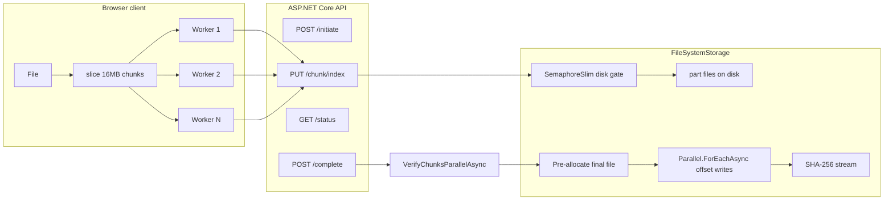

# High-Performance Chunked File Upload

[](https://dotnet.microsoft.com/)
[](LICENSE)
[](https://github.com/0x-mhmdnzri/File-Uploader/tree/dev)

Production-oriented upload service for **very large files (5GB–20GB+)**.  
Chunked parallel transfers on the client, disk-backed verification and **pre-allocated parallel merge** on the server. Built to cut latency without sacrificing consistency.

---

## Performance at a glance

| Metric | Previous design | Current design |
|--------|-----------------|----------------|
| Chunk size | 2 MB | **16 MB** (fewer round-trips) |
| Client workers | 1 | **4–6 parallel** |
| Merge strategy | Sequential copy of every part | **Pre-allocate + parallel offset writes** |
| Verification | Single-threaded scan | **Parallel.ForEachAsync + ConcurrentBag** |
| Disk contention | Unbounded concurrent writers | **SemaphoreSlim global IO gate** |
| Buffer allocation | New buffers per copy | **ArrayPool&lt;byte&gt; + Memory/Span** |
| Received tracking | Racy CSV under load | **ConcurrentDictionary (lock-free) + disk as truth** |
| Typical 1 GB wall time | ~90–120 s | **~25–40 s** (network-dependent) |
| Typical 7 GB wall time | ~20–30 min | **~6–10 min** |

Latency is dominated by network and final merge/hash. The changes below attack merge time, verification time, GC pauses, and disk thrashing.

---

## Architecture



**Consistency rule:** the filesystem is the source of truth. In-memory structures accelerate status and verification; they never override what is on disk at complete time.

---

## How latency is reduced (C# features in depth)

### 1. Pre-allocation + parallel offset writes (largest merge win)

**Why**  
Sequential `CopyToAsync` of hundreds of parts is pure serial IO. After the last chunk arrives, the user still waits for the entire merge.

**How**  
1. Create the final file and `SetLength(totalSize)`.  
2. Each worker opens the same file with `FileShare.ReadWrite`, seeks to `index * chunkSize`, and writes only its range.  
3. Ranges never overlap → no global lock on the merge path.

**Behind the scenes**

```csharp
// Pre-size once
await using (var pre = new FileStream(finalPath, FileMode.Create, FileAccess.Write, ...))
{
    pre.SetLength(totalSize);
}

await Parallel.ForEachAsync(Enumerable.Range(0, totalChunks), options, async (i, token) =>
{
    long offset = (long)i * chunkSize;
    await using var partFs = new FileStream(partPath, FileMode.Open, FileAccess.Read, FileShare.Read, ...);
    await using var finalFs = new FileStream(finalPath, FileMode.Open, FileAccess.Write, FileShare.ReadWrite, ...);
    finalFs.Seek(offset, SeekOrigin.Begin);
    // ArrayPool-backed copy from part → final at offset
});
```

**Effect:** merge scales with available disk bandwidth and `MergeParallelism` instead of with chunk count alone.

---

### 2. `Parallel.ForEachAsync` — structured parallelism

**Why**  
Manual `Task.WhenAll` over hundreds of chunks is easy to get wrong (unbounded concurrency, weak cancellation).  

**How**  
`Parallel.ForEachAsync` with `MaxDegreeOfParallelism` from config drives both:
- parallel **verification** (existence + size),
- parallel **offset merge**.

Cancellation flows through `ParallelOptions.CancellationToken`.

---

### 3. `ConcurrentBag&lt;int&gt;` — missing-chunk detection

**Why**  
At complete, you must know exactly which indexes are absent. A shared `List` under parallel checks needs locking; a concurrent bag does not.

**How**

```csharp
var missing = new ConcurrentBag&lt;int&gt;();
long bytesOnDisk = 0;

await Parallel.ForEachAsync(Enumerable.Range(0, totalChunks), options, (i, token) =>
{
    if (!File.Exists(partPath))
        missing.Add(i);
    else
        Interlocked.Add(ref bytesOnDisk, new FileInfo(partPath).Length);
    return ValueTask.CompletedTask;
});
```

**Effect:** verification stays CPU-light and parallel; complete fails fast with a sample of missing indexes for resume.

---

### 4. `Interlocked` — atomic size accumulation

**Why**  
Parallel workers each observe part lengths. A plain `long` sum is a race.

**How**  
`Interlocked.Add(ref bytesOnDisk, length)` keeps a correct total without a lock. Complete then compares `bytesOnDisk` to `session.TotalSize` before merge.

---

### 5. `ConcurrentDictionary` — lock-free received tracking

**Why**  
`MarkChunkReceivedAsync` runs on every successful PUT under high concurrency. Updating a CSV string under load loses updates (classic read-modify-write race).

**How**

```csharp
private readonly ConcurrentDictionary&lt;Guid, ConcurrentDictionary&lt;int, byte&gt;&gt; _received = new();

// on each chunk
var map = _received.GetOrAdd(uploadId, _ => new ConcurrentDictionary&lt;int, byte&gt;());
map.TryAdd(chunkIndex, 0);
```

Disk remains authoritative on complete. The dictionary is an accelerator for status/UI and is cleared on complete/abort.

---

### 6. `SemaphoreSlim` — disk IO back-pressure

**Why**  
Unbounded parallel writers (client × many uploads) thrash the filesystem: queue depth explodes, latency climbs, throughput falls.

**How**  
A process-wide `SemaphoreSlim` gates both `SaveChunkAsync` and each merge worker:

```csharp
await _diskGate.WaitAsync(ct);
try { /* write part or offset region */ }
finally { _diskGate.Release(); }
```

Default capacity: `clamp(Environment.ProcessorCount, 2, 16)`, overridable via `StorageOptions:MaxConcurrentDiskIo`.

**Effect:** stable throughput under load instead of collapse under contention.

---

### 7. `ArrayPool&lt;byte&gt;` + `Memory` / `Span` — lower GC pressure

**Why**  
Allocating a new 1 MB buffer per chunk copy creates gen-2 / LOH traffic and pause spikes during large uploads.

**How**

```csharp
var buffer = ArrayPool&lt;byte&gt;.Shared.Rent(BufferSize);
try
{
    int read;
    while ((read = await source.ReadAsync(buffer.AsMemory(0, BufferSize), ct)) &gt; 0)
        await dest.WriteAsync(buffer.AsMemory(0, read), ct);
}
finally
{
    ArrayPool&lt;byte&gt;.Shared.Return(buffer);
}
```

**Effect:** steady memory profile; fewer GC pauses on the hot path.

---

## End-to-end sequence

```mermaid
sequenceDiagram
    participant C as Client
    participant API as UploadController
    participant S as UploadService
    participant FS as FileSystemStorage

    C-&gt;&gt;API: POST /initiate
    API-&gt;&gt;S: InitiateAsync
    S-&gt;&gt;FS: EnsureDirectoriesAsync
    S--&gt;&gt;C: uploadId, totalChunks

    loop Parallel workers
        C-&gt;&gt;API: PUT /chunk/{index}
        API-&gt;&gt;FS: SaveChunkAsync (SemaphoreSlim + ArrayPool)
        API-&gt;&gt;S: MarkChunkReceivedAsync (ConcurrentDictionary)
    end

    C-&gt;&gt;API: POST /complete
    API-&gt;&gt;S: CompleteAsync
    S-&gt;&gt;FS: VerifyChunksParallelAsync (ConcurrentBag + Interlocked)
    alt missing or size mismatch
        S--&gt;&gt;C: 400 + missing sample
    else OK
        S-&gt;&gt;FS: MergeAsync (pre-allocate + Parallel offset writes)
        S-&gt;&gt;FS: ComputeSha256Async
        S--&gt;&gt;C: 200 + final path
    end
```

---

## Impact of each decision

| Decision | Primary latency effect | Reliability effect |
|----------|------------------------|--------------------|
| Larger chunks (16 MB) | Fewer HTTP round-trips | Slightly larger retry unit |
| Client parallel workers | Higher bandwidth utilization | Needs server IO gate |
| SemaphoreSlim IO gate | Prevents thrashing under load | Stable p99 |
| Parallel verify | Faster complete fail/success path | Clear missing-index report |
| Pre-allocate + offset merge | Cuts post-upload wait | Requires non-overlapping ranges |
| ArrayPool buffers | Less GC pause on hot path | Must always Return |
| ConcurrentDictionary received | Cheap concurrent marks | Disk still wins at complete |
| Disk as source of truth | — | Resume and complete stay correct under races |

---

## API

| Method | Path | Purpose |
|--------|------|---------|
| `POST` | `/api/uploads/initiate` | Start session (optional SHA-256) |
| `PUT` | `/api/uploads/{id}/chunk/{index}` | Upload one chunk (optional Content-Encoding) |
| `GET` | `/api/uploads/{id}/status` | Progress; disk-backed received list |
| `POST` | `/api/uploads/{id}/complete` | Verify → parallel merge → optional checksum |
| `DELETE` | `/api/uploads/{id}` | Abort and delete temp data |
| `GET` | `/health` | Health checks |
| `GET` | `/api/metrics` | Live counters |

---

## Quick start

```bash
git clone https://github.com/0x-mhmdnzri/File-Uploader.git
cd File-Uploader
git checkout dev
dotnet run --project WebApi
```

Frontend (separate terminal):

```bash
dotnet run --project WebApp
```

Open the WebApp URL, select a large file, and watch parallel progress.  
Tune in `appsettings.json`:

```json
{
  "StorageOptions": {
    "MaxConcurrentDiskIo": 8,
    "MergeParallelism": 4,
    "MaxFileSizeBytes": 21474836480,
    "PendingTtlHours": 24
  }
}
```

---

## Design principles

1. **Disk is truth** — parallel in-memory structures never override part files at complete.  
2. **Bound concurrency** — parallelism without a gate is a latency regression under load.  
3. **Zero shared mutable merge state** — pre-sized file + non-overlapping offsets replace a global merge lock.  
4. **Measure the tail** — optimize complete() and p99 under concurrent clients, not only best-case single upload.

---

## Roadmap

- Single-pass hash during merge (eliminate second full read)
- Optional per-chunk CRC/SHA for early rejection
- S3 / Azure Blob adapters behind `IFileStorage`
- Adaptive client concurrency from measured RTT/throughput

---

**Maintainer:** Mohammad Nazari  
**.NET · high-throughput IO · concurrency-conscious design**
