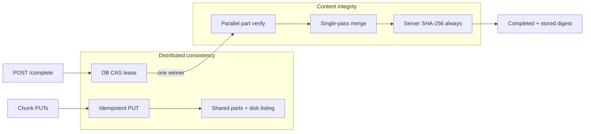
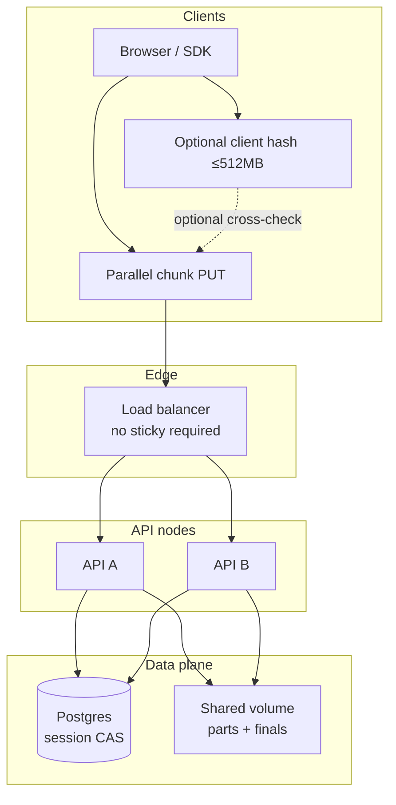
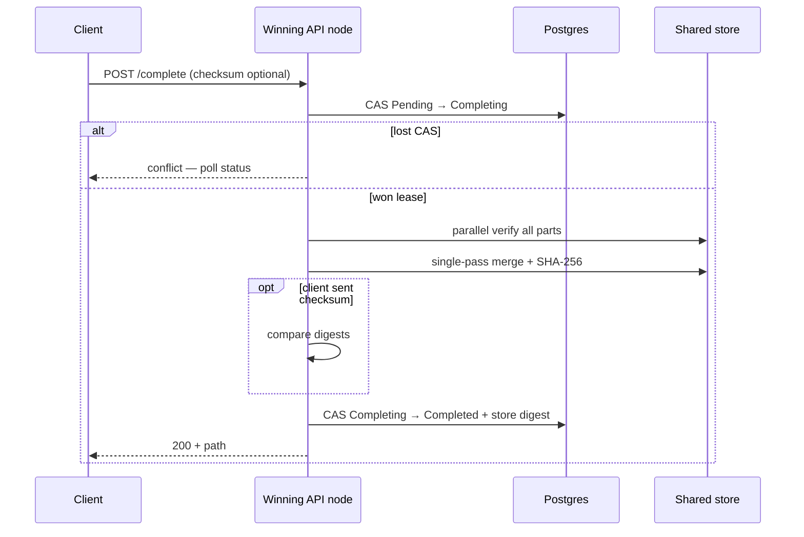

# File Uploader

**S3-inspired, own data-plane file service** for very large uploads — resumable, parallel, multi-instance ready, **integrity-first**.

[](https://dotnet.microsoft.com/)
[](#architecture)
[](#consistency-vs-integrity)
[](#multi-instance-p4)
[](#client-performance)
[](#proofs--quality)
[](https://github.com/0x-mhmdnzri/File-Uploader/tree/dev)

> Upload **5 GB – 20 GB+** with chunked parallel transfers, **disk-as-truth** part verification, **Postgres CAS** so only one node merges under a load balancer, and **mandatory server-side SHA-256** so content integrity is never optional — **no sticky sessions required**.

---

## Table of contents

- [Why this project](#why-this-project)
- [Consistency vs integrity](#consistency-vs-integrity)
- [Feature matrix](#feature-matrix)
- [Architecture](#architecture)
- [Performance engine (server)](#performance-engine-server)
- [Client performance](#client-performance)
- [Multi-instance (P4)](#multi-instance-p4)
- [API surface](#api-surface)
- [Security, quotas & observability](#security-quotas--observability)
- [Quick start](#quick-start)
- [Multi-node lab](#multi-node-lab-docker)
- [Proofs & quality](#proofs--quality)
- [Configuration](#configuration)
- [Documentation map](#documentation-map)
- [Roadmap](#roadmap)

---

## Why this project

Most “chunked upload” demos break under real conditions:

| Pain | What we do instead |
|------|---------------------|
| Lost chunk marks under concurrency | **Disk is source of truth**; in-memory is only a hint |
| Merge serializes on a global lock | **Pre-allocate + parallel offset writes** |
| Client hash blocks multi-GB start / end | **Non-blocking client hash**; **server always digests** |
| Skipping client hash skips integrity | **`AlwaysComputeFullChecksum`** — server SHA never optional |
| “HA” = sticky LB | **Shared metadata + shared parts + CAS** |
| Two nodes complete at once | `Pending → Completing → Completed/Failed` **CAS** |
| In-process locks as “distributed” | Explicit **non-goals** + fail-fast startup guard |

This is an **owned file service** (product plane = your volume / future blob nodes), not a thin wrapper around public S3 as the system of record.

---

## Consistency vs integrity

These are **two different guarantees**. Confusing them is how systems either race under a load balancer or silently accept corrupted bytes.



### What each layer protects

| Layer | Mechanism | Failure mode if removed |
|-------|-----------|-------------------------|
| **Coordination** | CAS `Pending → Completing` (only one node wins) | Two nodes merge the same upload → torn final file / double-write |
| **Part truth** | Shared volume + list/verify on disk | Node-local memory says “all chunks here” when they are not |
| **Idempotent PUT** | Existence check before rewrite | Retry storms corrupt or thrash the same part |
| **Byte integrity** | **Server full-file SHA-256 on every complete** | Bit flips, truncated parts, silent garbage accepted as `Completed` |
| **Optional cross-check** | Client checksum compared when present | Weaker early detection only — **never** a substitute for server hash |

### Rules of the system

1. **CAS answers:** *Who is allowed to merge right now?*  
2. **Disk answers:** *Are all parts present and sized correctly?*  
3. **SHA-256 answers:** *Is the assembled object the intended bitstream?*  
4. **Client hash answers (optional):** *Did the browser’s view of the file match?* — useful cross-check for small files, **not** the distributed control plane.

### Why client SHA is not the multi-node safety net

- Standard **SHA-256 is sequential**. You cannot shard a single digest across cores and get the same official hash without changing the algorithm (Merkle trees ≠ SHA-256 of the whole file).
- Waiting for a browser to hash **7 GB+** after a fast parallel upload creates a multi-minute **“Verifying…”** stall that is pure client CPU — while the cluster already has the parts on shared storage.
- **Failover / LB races are prevented by CAS + shared store**, not by the browser finishing `subtle.digest`.

### Server policy (authoritative)

| Setting | Default | Meaning |
|---------|---------|--------|
| **`AlwaysComputeFullChecksum`** | **`true`** | Complete **always** runs full-file SHA-256, even if the client sent no checksum |
| **`SinglePassMergeAndHash`** | **`true`** | Merge and hash in one ordered disk pass (avoid reading the final object twice) |
| **`Hasher`** | `Hardware` | Prefer OS / hardware crypto on the server |

If the client **does** send a checksum and it disagrees with the server digest → complete **fails**, final object is deleted, session → `Failed` (`checksum_mismatch`).

> **Lab only:** set `AlwaysComputeFullChecksum: false` to skip digest for speed tests. Never do that in multi-instance production.

---

## Feature matrix

### Upload core

| Feature | Status | Notes |
|---------|--------|--------|
| Chunked upload (default **16 MB**) | ✅ | Client + server aligned |
| Parallel workers (browser) | ✅ | Adaptive 2–6 from throughput |
| Resume / status from disk listing | ✅ | `GET /status` → `received[]` |
| Idempotent chunk PUT | ✅ | `{ idempotent: true }` if part exists |
| Optional Content-Encoding | ✅ | `gzip` / `deflate` / `br` per chunk |
| Optional per-chunk CRC32 / SHA-256 | ✅ | CRC32 via lookup **table**; chunk SHA via WebCrypto |
| Client full-file SHA (≤512 MB) | ✅ | WebCrypto; **never blocks complete** |
| Client full-file SHA (>512 MB) | ✅ **skipped** | Server is authoritative; avoids end-of-upload stall |
| **Server full-file SHA on complete** | ✅ **always** | `AlwaysComputeFullChecksum` |
| Single-pass merge + hash | ✅ | Default on |
| Pre-allocated parallel merge mode | ✅ | Config alternative to single-pass |
| Orphan / TTL cleanup | ✅ | Cluster-safe CAS claim |
| Abort | ✅ | CAS `Pending → Aborted` |

### Multi-instance (P4.0–P4.5)

| Feature | Status | Notes |
|---------|--------|--------|
| Shared session metadata (EF + Sqlite/Postgres) | ✅ | Postgres required when MultiInstance on |
| Optimistic concurrency (`Version`) | ✅ | |
| Complete lease CAS | ✅ | One node merges |
| Stable part key `{uploadId}/part/{index}` | ✅ | Shared volume friendly |
| Shared part store gate | ✅ | `SharedPartStoreConfigured` |
| Startup non-goals enforcement | ✅ | NG1 / NG2 / NG3 |
| Liveness / readiness probes | ✅ | `/health/live`, `/health/ready` |
| Client contract (no sticky) | ✅ | [docs/CLIENT-CONTRACT.md](docs/CLIENT-CONTRACT.md) |
| Unit + HTTP + two-node CI proofs | ✅ | [docs/PROOFS.md](docs/PROOFS.md) |
| Owned blob nodes design | ✅ design | [docs/OWNED-BLOB-NODES.md](docs/OWNED-BLOB-NODES.md) |
| EF migrations + bootstrap safety net | ✅ | [docs/MIGRATIONS.md](docs/MIGRATIONS.md) |

### Platform & DX

| Feature | Status |
|---------|--------|
| Hexagonal ports | ✅ |
| FileSystem product plane / S3 lab adapter | ✅ |
| API key auth + anonymous health | ✅ |
| Quotas, Serilog, audit, metrics, events | ✅ |
| Dev CORS any `localhost` / `127.0.0.1` | ✅ |
| WebApp `ApiBase` → `http://localhost:5073` | ✅ |

---

## Architecture



**Complete path (winner node only)**



**Ports & adapters**

| Port | Adapter(s) |
|------|------------|
| `IUploadRepository` | `EfUploadRepository` (Sqlite / Postgres) |
| `IFileStorage` | `FileSystemStorage` (product), `S3FileStorage` (lab) |
| `IFileHasher` | `HardwareSha256FileHasher` / `Sha256FileHasher` |
| `IUploadEventPublisher` | Channel bus → logging / webhook / RabbitMQ |

**Part layout**

```text
{TempPath}/{uploadId:N}/part/0
{TempPath}/{uploadId:N}/part/1
...
{FinalPath}/{fileName}
```

---

## Performance engine (server)

### Results (indicative)

| File size | Naive / early design | Current engine |
|-----------|----------------------|----------------|
| ~1 GB | ~90–120 s | **~25–40 s** |
| ~7 GB | ~20–30 min | **~6–10 min** transfer; complete dominated by **merge+hash IO** |
| 12 GB+ | Unstable / failed | **Stable** (limits permitting) |

*End-of-upload time on multi-GB files is intentionally mostly **server disk + SHA**, not browser JavaScript.*

### C# primitives

| Primitive | Role |
|-----------|------|
| **`Parallel.ForEachAsync`** | Parallel part verify / optional parallel merge |
| **`ConcurrentBag`** | Missing indexes without caller locks |
| **`Interlocked`** | Atomic on-disk byte totals |
| **`ConcurrentDictionary`** | Lock-free received hints (not truth) |
| **`SemaphoreSlim`** | Global disk IO gate |
| **`ArrayPool` + `Memory`/`Span`** | Lower GC on hot path |
| **EF CAS (`ExecuteUpdateAsync`)** | Cross-node complete / abort / expire |
| **Hardware hasher** | Full-file digest on complete |

---

## Client performance

Browser uploader: `WebApp/wwwroot/js/upload.js`.

### Full-file hash policy (current)

| File size | Client behavior | Why |
|-----------|-----------------|-----|
| **≤ 512 MB** | Optional **WebCrypto** one-shot in parallel with upload | Fast, hardware-backed when the browser allows |
| **> 512 MB** | **No client full-file SHA** | Sequential hash would stall the UI after a fast parallel upload |
| **At `complete`** | **Never awaits** an unfinished client hash | Sends checksum only if already ready; otherwise server-only digest |

Per-chunk integrity (when enabled by server):

- **CRC32** — classic **256-entry lookup table** (hash table) for O(1) per byte  
- **SHA-256** — prefers `crypto.subtle` over pure JS

### Upload workers

- Chunk size **16 MB**  
- **2–6** concurrent workers, adapted from measured MB/s  
- Pause / resume / cancel + `localStorage` resume + `GET /status`

### Dev wiring

| Setting | Value |
|---------|--------|
| WebApp `ApiBase` | `http://localhost:5073` |
| WebApi CORS (Development) | Any `localhost` / `127.0.0.1` origin |
| Profiles | API `http://localhost:5073` · App `http://localhost:5074` |

---

## Multi-instance (P4)

### Non-goals (`MultiInstance:Enabled=true`)

| ID | Non-goal |
|----|----------|
| **NG1** | In-process locks as cross-node coordination |
| **NG2** | Sticky LB as HA |
| **NG3** | External S3/MinIO as product data plane |

### Coordination

| Operation | CAS |
|-----------|-----|
| Complete | `Pending → Completing` → merge+hash → `Completed` / `Failed` |
| Abort | `Pending → Aborted` |
| Orphan cleanup | Expired claim → `Expired` (one winner deletes parts) |

### Health

| Endpoint | Meaning |
|----------|--------|
| `/health/live` | Process up |
| `/health/ready` | DB + storage writable |
| `/health` | Aggregate |

---

## API surface

| Method | Path | Purpose |
|--------|------|--------|
| `POST` | `/api/uploads/initiate` | Create session |
| `PUT` | `/api/uploads/{id}/chunk/{index}` | Idempotent part upload |
| `GET` | `/api/uploads/{id}/status` | Disk-backed progress |
| `POST` | `/api/uploads/{id}/complete` | CAS → verify → merge → **always SHA** → finish |
| `DELETE` | `/api/uploads/{id}` | Abort |
| `GET` | `/health/live` · `/health/ready` · `/health` | Probes |
| `GET` | `/api/metrics` | Snapshot |

### Client contract

1. Any healthy node may handle any step for an `uploadId`.  
2. Retry chunk PUT on 502/503/timeout.  
3. Rebuild progress from `GET /status`.  
4. On complete CAS conflict, poll until terminal.  
5. Client full-file checksum is **optional**; **server digest is mandatory**.  
6. If both exist and differ → complete fails (integrity).

---

## Security, quotas & observability

- API key middleware; `/health*` anonymous by default  
- Extension allow/block lists; max file / chunk size  
- Quotas: pending per IP; stored bytes global & per IP  
- Serilog + audit; domain events (log / webhook / RabbitMQ)  
- Health: database + storage probes  

---

## Quick start

```bash
git clone https://github.com/0x-mhmdnzri/File-Uploader.git
cd File-Uploader
git checkout dev

dotnet run --project WebApi --launch-profile http
# other terminal
dotnet run --project WebApp --launch-profile http
```

Open **http://localhost:5074** → API **http://localhost:5073**.

> Boot applies **EF migrations** (with schema safety net). Broken lab DB → delete `uploads.db` or see [docs/MIGRATIONS.md](docs/MIGRATIONS.md).

```bash
dotnet test tests/WebApi.Tests/WebApi.Tests.csproj -v n
chmod +x tools/proofs/http-proofs.sh && BASE=http://localhost:5073 ./tools/proofs/http-proofs.sh
```

---

## Multi-node lab (Docker)

```bash
docker compose -f docker-compose.multi.yml up --build -d
BASE_A=http://localhost:5073 BASE_B=http://localhost:5075 ./tools/proofs/http-proofs.sh
docker compose -f docker-compose.multi.yml down -v
```

| Service | Port |
|---------|------|
| `api-a` / `api-b` | **5073** / **5075** |
| Postgres | 5432 |

CI: `.github/workflows/proofs.yml`.

---

## Proofs & quality

| Layer | Proves |
|-------|--------|
| xUnit CAS | One winner for complete / abort / expire |
| `http-proofs.sh` | Happy path, idempotent PUT, double-complete |
| Docker two-node | Shared volume + Postgres |
| GitHub Actions | Gate on `dev` / `main` |

---

## Configuration

```json
{
  "Database": { "Provider": "Sqlite" },
  "ConnectionStrings": { "Default": "Data Source=uploads.db" },
  "MultiInstance": {
    "Enabled": false,
    "SharedPartStoreConfigured": false,
    "RequirePostgres": true,
    "ForbidExternalObjectStoreAsProductPlane": true
  },
  "StorageOptions": {
    "Provider": "FileSystem",
    "TempPath": "temp",
    "FinalPath": "uploads",
    "MaxFileSizeBytes": 21474836480,
    "MaxConcurrentDiskIo": 8,
    "MergeParallelism": 4,
    "SinglePassMergeAndHash": true,
    "AlwaysComputeFullChecksum": true,
    "Hasher": "Hardware"
  },
  "Auth": {
    "Enabled": false,
    "ApiKey": "",
    "AnonymousPathPrefixes": [ "/health", "/swagger" ]
  }
}
```

| Key | Production guidance |
|-----|---------------------|
| `AlwaysComputeFullChecksum` | **Keep `true`** |
| `SinglePassMergeAndHash` | `true` when complete is hash/IO bound |
| `MultiInstance:Enabled` | Requires Postgres + shared part store |

WebApp: `"ApiBase": "http://localhost:5073"`.

---

## Documentation map

| Doc | Content |
|-----|--------|
| [MULTI-INSTANCE.md](docs/MULTI-INSTANCE.md) | Non-goals, CAS, shared store, LB |
| [CLIENT-CONTRACT.md](docs/CLIENT-CONTRACT.md) | Retries, status, complete |
| [PROXY.md](docs/PROXY.md) | nginx / Caddy / k8s |
| [PROOFS.md](docs/PROOFS.md) | Proof runbook |
| [MIGRATIONS.md](docs/MIGRATIONS.md) | EF migrate |
| [OWNED-BLOB-NODES.md](docs/OWNED-BLOB-NODES.md) | Future data plane |
| [CONFIG.md](docs/CONFIG.md) | Settings |
| [BACKLOG.md](BACKLOG.md) | Checklist |

---

## Design principles

1. **Disk is truth** for parts; **CAS is truth** for who may merge.  
2. **Server SHA-256 is mandatory** for completed objects (`AlwaysComputeFullChecksum`).  
3. **Client hash is optional UX**, never the distributed control plane, and must **not block** complete.  
4. **Bound concurrency** — parallelism without an IO gate regresses p99.  
5. **No sticky LB for correctness.**  
6. **Fail fast at boot** when multi-instance is claimed without prerequisites.  
7. **Prove it** — unit CAS, HTTP scripts, two-node compose, CI.

---

## Roadmap

| Item | Status |
|------|--------|
| Blob node implementation (D8) | Future |
| WASM client hash for medium files | Optional |
| Provider-split EF migrations | Only if needed |

---

**Maintainer:** Mohammad Nazari  
**.NET 9 · high-throughput IO · CAS coordination · mandatory content integrity**

```bash
git checkout dev && dotnet run --project WebApi --launch-profile http
```
