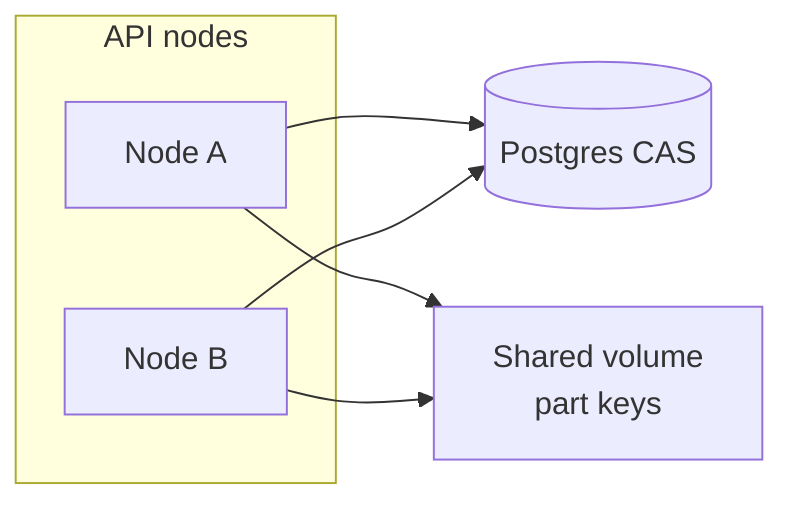

# Multi-instance (P4)

## P4.0 — Explicit non-goals (enforced at startup when MultiInstance is on)

This product is an **S3-inspired** file service. It does **not** treat external object stores or in-process locks as the multi-node design.

| ID | Non-goal | Why |
|----|----------|-----|
| **NG1** | Fix multi-node with `SemaphoreSlim` / `Mutex` / `ConcurrentDictionary` alone | Those primitives stop at process (or single OS) boundary. They do not order work across machines. |
| **NG2** | Sticky load balancer as long-term HA | Affinity hides the bug until node death, deploy, or uneven routing. Resume and complete must work on **any** healthy instance. |
| **NG3** | External AWS/MinIO as the *product* data plane | Optional adapter may exist for experiments. Product plane is **own** shared part storage (shared volume now; owned blob nodes later). |

### Config gate

```json
"MultiInstance": {
  "Enabled": false,
  "SharedPartStoreConfigured": false,
  "RequirePostgres": true,
  "ForbidExternalObjectStoreAsProductPlane": true
}
```

When `Enabled: true`, process **refuses to start** unless:

1. `Database:Provider` is Postgres (shared metadata — D1), and  
2. `SharedPartStoreConfigured: true` (you affirm every node sees the same temp/final volume — D6), and  
3. `StorageOptions:Provider` is not `S3` (unless you deliberately set `ForbidExternalObjectStoreAsProductPlane: false` for lab).

Single-node lab: leave `Enabled: false`.

Boot always logs the three non-goals so operators cannot claim they were implicit.

---

## D1–D4 — Shared metadata & CAS complete (done)

| Item | Behavior |
|------|----------|
| `UploadStatus.Completing` | Exclusive merge lease |
| `UploadSession.Version` | Concurrency token |
| `TryBeginCompleteAsync` | CAS `Pending → Completing` |
| `TryFinishCompleteAsync` / `TryFailCompleteAsync` | Terminal states |
| `CompleteAsync` | No session-cache trust; DB + storage verify |

### Database

```json
"Database": { "Provider": "Sqlite" }
```

Multi-node metadata:

```json
"Database": { "Provider": "Postgres" },
"ConnectionStrings": {
  "Default": "Host=db;Port=5432;Database=fileuploader;Username=app;Password=secret"
}
```

---

## P4.2 — Shared part / object store (own data plane)

Metadata CAS does **not** move bytes. Every API node must see the **same** part and final objects.

### D5 — Stable part key

Layout on the shared volume (and aligned S3 experimental keys):

```
{TempPath}/{uploadId:N}/part/{index}
```

Examples:

```
temp/a1b2c3d4e5f6.../part/0
temp/a1b2c3d4e5f6.../part/1
uploads/my-video.mp4
```

All path resolution goes through centralized helpers in `FileSystemStorage` (`PartPath`, `PartDir`, `SessionTempDir`). Merge, verify, delete, and list never invent node-local paths (D9).

> **Migration note:** Older layout was `{TempPath}/{uploadId}/{uploadId}.part{n}`. Wipe lab `temp/` after upgrade; in-flight sessions with the old layout will not resume.

### D6 — Shared filesystem volume

1. Provision one volume visible to every API node (NFS, SMB, Gluster, EFS, CephFS, etc.).
2. Point **all** nodes at the same absolute paths:

```json
"StorageOptions": {
  "Provider": "FileSystem",
  "TempPath": "/mnt/uploader/temp",
  "FinalPath": "/mnt/uploader/uploads"
},
"MultiInstance": {
  "Enabled": true,
  "SharedPartStoreConfigured": true
}
```

3. Set `SharedPartStoreConfigured: true` only after you have verified that a file written on node A is readable on node B under those paths.
4. On boot with MultiInstance enabled, the process logs the resolved full paths so you can confirm the mount.

### D7 — Shared-FS failure modes

| Failure | Symptom | Mitigation |
|---------|---------|------------|
| Mount missing / wrong path on one node | Chunk PUT 200 on A, complete on B reports missing parts | Health check + readiness that probes TempPath; never rely on sticky LB |
| Split-brain mounts (two different volumes) | Same key, different bytes | Single volume ID; ops runbook; `SharedPartStoreConfigured` is an explicit ack |
| NFS close-to-open / cache delay | B does not see part just written by A | Prefer mounts with close-to-open consistency; short sleep is **not** a product fix |
| Permission mismatch across nodes | 500 on SaveChunk / Merge | Same UID/GID or ACL on all nodes |
| Disk full on shared volume | Writes fail mid-upload | Quotas + monitoring on the shared volume |
| Partial network partition | Some nodes see volume, others timeout | Fail the node (readiness); clients retry another instance |

**Rule:** Resume and `/complete` must succeed on **any** healthy instance. If that requires sticky routing, the part store is not shared correctly.

### D9 — Merge never assumes node-local-only temp

- Merge reads only via `PartPath(uploadId, index)`.
- Final file is written only under configured `FinalPath`.
- No process-local scratch directory is used as the source of truth for parts (S3 adapter may use a local merge buffer, but product plane under MultiInstance is FileSystem on the shared volume).

### D8 — Owned blob nodes (later)

Future design: dedicated blob nodes with an internal object API. Until then, shared volume + stable keys is the supported multi-node data plane.

---

## P4.3 — Thin distributed coordination

**Principle:** no Redis/etcd lock service. Coordination is a thin layer of **database CAS** plus **idempotent I/O** on the shared part store.



### D10 — Idempotent chunk PUT

`PUT /api/uploads/{id}/chunk/{index}`:

1. Validates session is still `Pending`.
2. If `ChunkExistsAsync` is true on the shared store → **200** with `{ idempotent: true }` (no rewrite).
3. Otherwise write the part; concurrent double-write still ends as one object (`FileMode.Create` / object overwrite).

Clients may retry freely across any node. Status listing always uses **disk listing**, not per-node memory.

### D11 / D12 — Cluster-safe cleanup & abort

| Operation | CAS | Winner does |
|-----------|-----|-------------|
| Orphan cleanup | `TryClaimExpiredAsync` — `(Pending\|Completing) + expired → Expired` | `DeleteTempFolderAsync` |
| Abort | `TryAbortAsync` — `Pending → Aborted` | `DeleteTempFolderAsync` |
| Complete (existing) | `TryBeginCompleteAsync` — `Pending → Completing` | merge + finish/fail CAS |

Every node runs `OrphanCleanupService`. Only the CAS winner deletes parts for a given session; others skip (`claimed` / `skipped` counters in logs).

Stuck `Completing` past `ExpiresAt` is claimable so a dead merger cannot leave parts forever.

### What we deliberately do **not** lock

- Per-chunk write leases (idempotent overwrite is enough).
- Global cluster mutex for cleanup cycles (per-session CAS is enough).
- Sticky routing as a substitute for shared store or CAS (NG2).

---

## P4.4 — Load balancer & client contract

### D13 — LB policy

- Route to any instance that passes readiness.
- **Do not** require cookie/IP affinity for correctness.
- Prefer `least_conn` or round-robin over sticky.

Details and nginx/Caddy/k8s samples: [PROXY.md](./PROXY.md).

### D14 — Probes

| Endpoint | Meaning |
|----------|--------|
| `GET /health/live` | Process alive (`self`) |
| `GET /health/ready` | **Postgres** reachable + **TempPath/FinalPath** writable |
| `GET /health` | Aggregate |

Ready → **503** removes the node from the pool when the shared volume or DB is broken on that host.

### D15 — Client contract

Full rules: [CLIENT-CONTRACT.md](./CLIENT-CONTRACT.md).

Summary:

- Retry chunk PUT on 502/503/timeout (idempotent).
- Rebuild progress from `GET /status` (`received` from disk).
- On complete CAS conflict, poll status until terminal.
- Never assume the same backend for initiate → chunks → complete.

---

## Minimal multi-node checklist

1. Postgres for sessions (D1–D4).
2. Shared volume mounted at the same `TempPath` / `FinalPath` on every API node (D6).
3. `MultiInstance:Enabled=true` and `SharedPartStoreConfigured=true`.
4. `StorageOptions:Provider=FileSystem`.
5. Load balancer health = **`/health/ready`**, no sticky required (P4.4 / NG2).
6. Wipe old temp folders after the D5 layout change.
7. Rely on CAS + idempotent PUT (P4.3) — not in-process locks alone (NG1).
8. Clients follow [CLIENT-CONTRACT.md](./CLIENT-CONTRACT.md).

### Ops note

Lab SQLite DBs from before `Version` / `Completing` may need wipe; `EnsureCreated` does not migrate.
