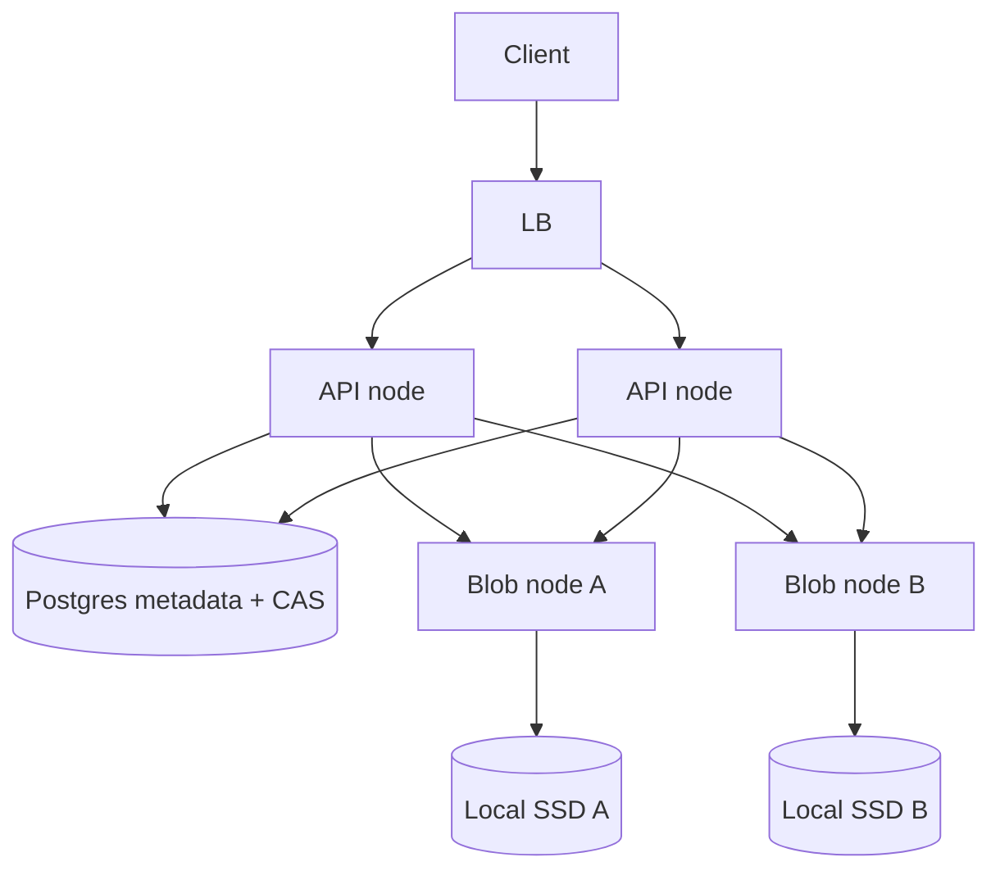

# D8 — Owned blob nodes (design)

Status: **design only** (not implemented). Product plane today = shared filesystem volume (P4.2). This document is the next evolution when NFS/EFS becomes the bottleneck or ops constraint.

## Goal

Replace “every API node mounts the same disk” with **first-party blob nodes** that own bytes, while API nodes remain stateless frontends for initiate / auth / CAS / client protocol.



## Responsibilities

| Component | Owns |
|-----------|------|
| **API** | Client protocol, quotas, auth, session CAS, choose blob placement, orchestrate merge |
| **Postgres** | `UploadSession` + optional `PartLocation` rows |
| **Blob node** | Durable part objects + final objects on **local** disk; HTTP/gRPC put/get/delete/list |

External S3 remains **NG3** (experimental adapter only), not the product plane.

## Stable object keys (unchanged from D5)

```
parts/{uploadId:N}/part/{index}
files/{finalFileName}
```

Keys are cluster-global; the blob node id is metadata, not part of the client URL.

## Placement strategies (choose one per deploy)

1. **Primary + optional replica** — write to one blob node; async replicate for durability.
2. **Hash(uploadId) → node** — sticky by object, simple; rebuild map on topology change.
3. **Least-loaded** — API queries blob node free space via heartbeat; better balance, more moving parts.

API records `BlobNodeId` (and optional replica set) on the session or per-part row at first PUT.

## Blob node API (sketch)

```
PUT    /v1/objects/{key}          body = bytes, Idempotent-Key optional
GET    /v1/objects/{key}
HEAD   /v1/objects/{key}          → size, etag
DELETE /v1/objects/{key}
GET    /v1/objects?prefix=parts/{uploadId}/
POST   /v1/compose                ordered keys → final key (optional server-side merge)
GET    /v1/health/ready           local disk writable + free space
```

Auth: mTLS or service token between API and blob nodes (never exposed to public clients in v1).

## Merge

**Preferred:** blob node `compose` (sequential read of parts → write final) to avoid shipping all bytes through the API process.

**Fallback:** API streams parts from blob node(s) and writes final (same as today’s S3 adapter pattern).

CAS for complete stays on **Postgres** (P4.1/P4.3) — blob nodes do not vote on session state.

## Failure modes

| Failure | Behavior |
|---------|----------|
| Blob node down mid-upload | Client retries PUT; API redirects to replica or marks part missing |
| Blob node down at complete | Fail complete or re-place missing parts; CAS → Failed if unrecoverable |
| Split brain placement map | Topology config in Postgres/etcd; API refuses write if node not in quorum |
| Disk full on blob node | Ready=false; API stops placing new uploads there |

## Migration path from shared FS

1. Keep `IFileStorage` as the port.
2. Add `BlobNodeFileStorage : IFileStorage` that talks HTTP to blob nodes.
3. Dual-run: shared FS for lab; blob nodes for multi-AZ.
4. Deprecate `SharedPartStoreConfigured` shared-volume requirement when all parts live on blob nodes; MultiInstance then requires “blob topology configured” instead.

## Non-goals (still)

- Replacing Postgres CAS with blob-node locks
- Sticky LB as correctness
- Making public clients talk to blob nodes directly in v1

## Implementation order (when scheduled)

1. Blob node minimal binary (put/get/head/delete/list + ready)
2. `BlobNodeOptions` + registry in config/Postgres
3. `BlobNodeFileStorage`
4. Compose endpoint + API complete path
5. Chaos proofs (node kill during PUT/complete)
